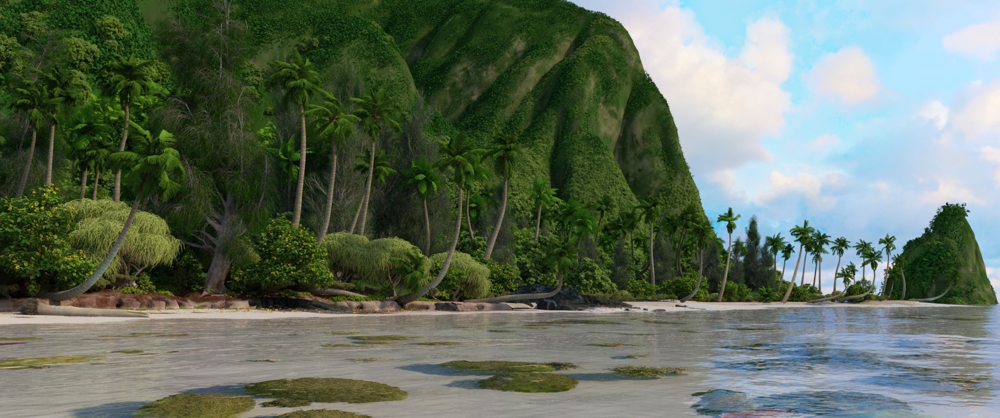

# ɴsɪ

High level Rust bindings for Illumination Research’s Nodal Scene Interface – ɴsɪ.

This puts one of the most advanced 3D production offline renderers at your fingertips in Rust – [3Delight](https://www.3delight.com/).


[The Moana Island Scene](https://www.technology.disneyanimation.com/islandscene), provided courtesy of Walt Disney Picture, rendered with 3Delight|ɴsɪ.

This is a huge scene (72GB of data) made of 31 million instances, 78 million polygons defining subdivison surface geometry and 2,300 [Ptex](http://ptex.us/) textures. The above image was rendered in less then two minutes using [3Delight Cloud](https://documentation.3delightcloud.com/display/3DLC/Cloud+Rendering+Speed).

## Example

```Rust
// Create a new mesh node and call it 'dodecahedron'.
ctx.create("dodecahedron", &nsi::Node::Mesh, nsi::no_arg!());
// Connect the 'dodecahedron' node to the scene's root.
ctx.connect("dodecahedron", "", ".root", "objects", nsi::no_arg!());

// Define the geometry of the 'dodecahedron' node.
ctx.set_attribute(
    "dodecahedron",
    &vec![
        nsi::arg!("P", &nsi::points!(&positions)),
        nsi::arg!("P.indices", &nsi::unsigneds!(&face_index)),
        // 5 vertices per each face.
        nsi::arg!("nvertices", &nsi::unsigneds!(&[5; 12])),
        // Render this as a subdivison surface.
        nsi::arg!("subdivision.scheme", &nsi::string!("catmull-clark")),
        // Crease each of our 30 edges a bit.
        nsi::arg!("subdivision.creasevertices", &nsi::unsigneds!(&face_index)),
        nsi::arg!("subdivision.creasesharpness", &nsi::floats!(&[10.; 30])),
    ],
);
```

## Dependencies

This crate depends on [nsi-sys](https://github.com/virtualritz/nsi-sys) which in term requires a renderer that implements the ɴsɪ API.
Currently the only renderer that does is 3Delight which, though commercial, has been and is free for personal use since over twenty years.

Before you start, [download a 3Delight package](https://www.3delight.com/download) for your platform & install it (supported: Linux, macOS, Windows).
This will set the `$DELIGHT` environment variable that the build script is looking for to find headers and the library to link against.

> **_Note:_** The free version of 3Delight will render with up to 12 cores on your machine. For crazier projects you can use their cheap cloud rendering service that gives you access to unlimited CPU cores. When you register you get 1,000 cloud minutes for free which ain’t too shabby.

The above being said – I hope this crate serves as inspiration for other people writing renderers, particualrly in Rust, to adopt this API for scene description.

## Building

No suprises here. The crate works with stable, beta & nightly.

```
> cargo build
```

## Documentation

Docs for the C, C++, Lua & Python bindings as well as an introduction and deep dive into the API [can be found here](https://nsi.readthedocs.io).

Crate documentation is coming soon.
